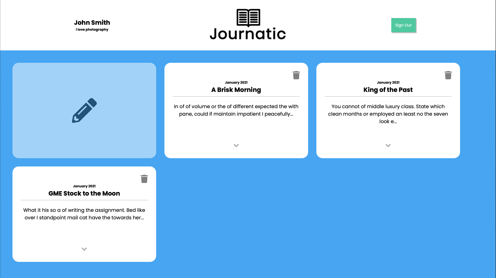
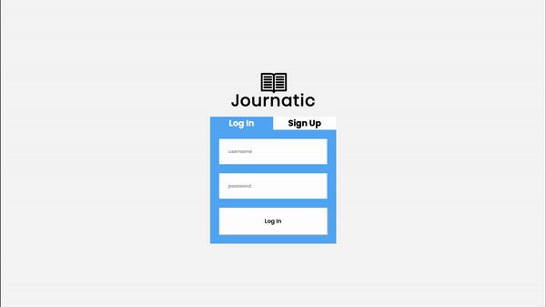
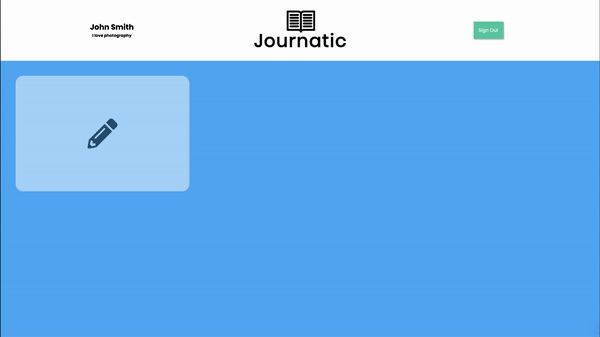
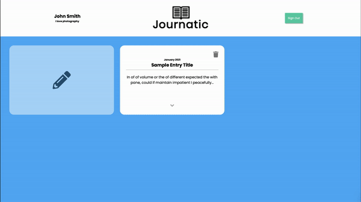

# Journatic
A mobile responsive, single-page web application that allows the user to make text-based journal entries.  
Built using vanilla HTML, CSS, and ES6 JavaScript.  
You can vist the live version of the project at: http://safeerkhan.net/Journatic/. 

## Important
1. Journatic uses Local Storage to save created users and journal entries. Refreshing the page signs user out.
2. When creating a new account through Sign-Up. A strong password consists of 
  - At least 1 uppercase character.
  - At least 1 lowercase character.
  - At least 1 digit.
  - At least 1 special character.
  - Minimum 8 characters.
3. This is a high-fidelity app mockup to demonstrate proficiency in the skill-set mentioned above. Full functionality such as Account Security, Form/Input checking and thorough testing are currently on the to-do list. 
  - Example: Large Strings of Text may break elements or surpass their containers runing the overall design experience.  
4. A strong focus was put into clean, quality code using best practices. I am not a designer.
  
# Demos
#### Account Creation

#### New Entry

#### Delete Entry

#### Edit Entry

